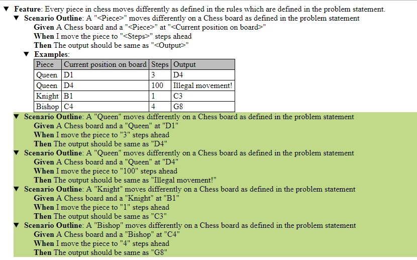

# Checkmate

Chess is a two-player strategy board game played on a chessboard, a checkered game board with 64 squares arranged in an 8×8 grid. Checkmate is a modified game of chess.

## Getting Started

These instructions will get you a copy of the project up and running on your local machine for development and testing purposes. See deployment for notes on how to deploy the project on a live system.

### Prerequisites

What things you need to install the software and how to install them

```
Checkmate is a Maven project developed using Java 1.8 
```

### Installing

A step by step series of examples that tell you how to get a development env running

Say what the step will be

```
Clone or download the project from https://github.com/Shylendra/Checkmate.

Build the project using Maven build.

Follow the included Cucumber test under /src/test/java/cucumber/CheckmateCucumberTest.java 
to see how to use Checkmate components.
```

## Running the tests

Steps to run the automated tests for this system

### The Cucumber scenarios are captured in  src/test/resources/cucumber.features

Here are the scenarios covered to test basic functionality of the system:
```
Feature: Every piece in chess moves differently as defined in the rules 
          which are defined in the problem statement.

  Scenario Outline: A "<Piece>" moves differently on a Chess board 
                    as defined in the problem statement                   
    Given A Chess board and a "<Piece>" at "<Current position on board>"
    When I move the piece to "<Steps>" steps ahead
    Then The output should be same as "<Output>"
    
    Examples:
  		| Piece       | Current position on board | Steps           | Output            |
   		| Queen       | D1                        | 3               | D4                |
   		| Queen       | D4                        | 100             | Illegal movement! |
   		| Knight      | B1                        | 1               | C3                |
   		| Bishop      | C4                        | 4               | G8                |
```

### Cucumber report

The Cucumber JUnit test case generates the cucumber report:


## Deployment

The maven build generates deployable jar/war which can be used to deploy on live system.

## Built With

* [Java 8](https://www.oracle.com/technetwork/java/javase/downloads/jdk8-downloads-2133151.html) - The programming language used
* [Maven](https://maven.apache.org/) - Dependency Management
* [JUnit](https://junit.org/junit5/) - Used for unit and automated tests
* [Cucumber](https://cucumber.io/) - Used to run automated acceptance tests written in a Behavior-Driven Development(BDD) style.


